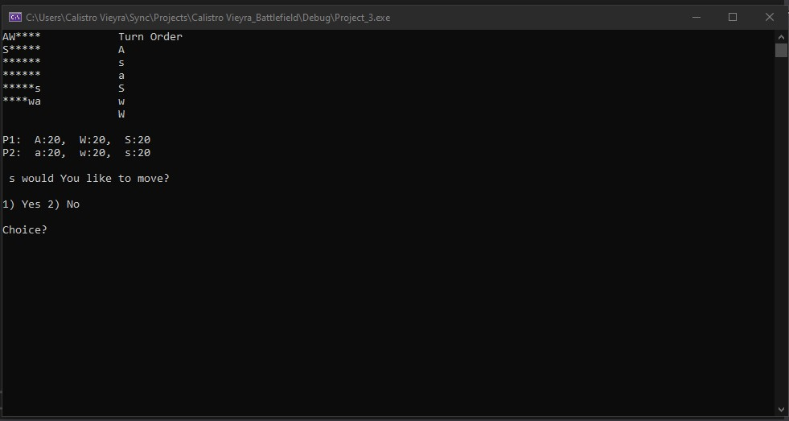

# Battle_Field

•	Two player game.

•	Each player will have a Warrior, Archer, and a Sorcerer.

•	On a 6x6 grid the characters can attack the opponent when in range.

•	Warrior attack range is 1.

•	Archer attack range is 4.

•	Sorcerer attack range is 2.

•	Warrior has a random attack from 7 to 14.

•	Archer has a random attack from 2 to 7.

•	Sorcerer has a random attack from 1 to 10.

•	Players character turn will always initially begin in random order.

•	Use the arrow keys to move player character.

•	You also have the option to not move if you wish.

•	If your character is not allowed to move or attack, that turn will be forfeited.

•	Player with his three characters dead first loses.
